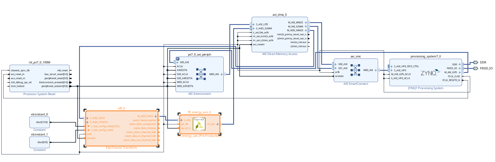

# Bearing Anomaly Detection on Zynq-7010

A hardware/software co-design for bearing-condition monitoring on a **Xilinx Zynq-7010**. The programmable logic accelerates the 1024-point FFT and power-spectrum computation, while the ARM processing system performs feature extraction and autoencoder-based anomaly detection using NEON SIMD instructions.

> **Current status:** functional bare-metal prototype. The supplied `main.c` uses a generated 500 Hz sine wave sampled at 12 kHz as a test input.

## System architecture



The processing chain is:

```text
1024 vibration samples
        │
        ▼
PS: mean/std normalization + Hann window
        │  1024 complex float samples, 64-bit AXI4-Stream
        ▼
AXI DMA MM2S
        │
        ▼
PL: Xilinx 1024-point FFT
        │
        ▼
PL: HLS spectrum-energy IP, |X[k]|²
        │  513 float energy bins, k = 0...512
        ▼
AXI DMA S2MM
        │
        ▼
PS: 23 time/frequency-domain features
        │
        ▼
PS: standardization + NEON autoencoder
        │
        ▼
Reconstruction error > threshold ? ABNORMAL : NORMAL
```

## Hardware/software partition

### Programmable logic

- **AXI DMA**, configured in simple mode, transfers data between DDR and the streaming pipeline.
- **Xilinx FFT IP** computes a 1024-point complex FFT.
- **`fft_energy_axis` HLS IP** consumes all 1024 complex FFT outputs and emits the 513 non-redundant bins required for a real-valued input signal.
- Each input stream word is 64 bits:
  - bits `[31:0]`: IEEE-754 single-precision real component;
  - bits `[63:32]`: IEEE-754 single-precision imaginary component.
- Each output word is a 32-bit IEEE-754 energy value:

  ```text
  energy[k] = real[k]² + imag[k]²
  ```

- `TLAST` is asserted on output bin 512.

### Processing system

The ARM side performs:

1. Time-domain feature extraction.
2. Signal standardization and Hann-window preprocessing.
3. AXI DMA control and cache maintenance.
4. Frequency-domain feature extraction from the 513 returned energy bins.
5. Feature scaling using exported training statistics.
6. Autoencoder inference using ARM NEON vector operations.
7. Reconstruction-error calculation and threshold-based classification.

## Extracted features

The model uses **23 effective features**. A twenty-fourth reserved value is kept at zero so the feature structure can be processed in four-float NEON vectors.

| Group | Features |
|---|---|
| Time domain | mean, standard deviation, variance, RMS, peak, peak-to-peak, crest factor, skewness, kurtosis |
| Spectral energy | total energy, 0–500 Hz, 500–1500 Hz, 1500–3000 Hz, 3000–6000 Hz |
| Energy ratios | one ratio for each of the four frequency bands |
| Dominance | dominant frequency, dominant magnitude |
| Spectral shape | spectral centroid, spectral bandwidth, spectral flatness |

With a 12 kHz sampling rate and a 1024-point FFT, the frequency resolution is 11.71875 Hz.

## Autoencoder

The deployed network is stored as C arrays in `software/include/weights.h`.

```text
24 inputs → 16 → 8 → 16 → 24 outputs
            ReLU  ReLU  ReLU  Linear
```

The vector contains 23 model features plus one zero-valued padding element. Dense layers are evaluated four outputs at a time with ARM NEON. The final decision compares the mean reconstruction error against the exported anomaly threshold:

```text
ANOMALY_THRESHOLD = 1.661848664
```

## Repository structure

```text
Bearing-Anomaly-Detection-on-Zynq-7010/
├── README.md
├── .gitignore
├── docs/
│   └── images/
│       └── bearing_anomaly_block_design.png
├── hardware/
│   ├── hls/
│   │   └── fft_energy_axis.cpp
│   └── vivado/
│       └── README.md
│       └── block_design.tcl
└── software/
    ├── src/
    │   ├── main.c
    │   ├── autoencoder.c
    │   ├── decision_making.c
    │   └── feature_extraction.c
    └── include/
        ├── autoencoder.h
        ├── decision_making.h
        ├── feature_extraction.h
        ├── freq_bins.h
        ├── pl_helpers.h
        └── weights.h
```

This structure intentionally excludes generated Vivado runs, IP caches, BSP files, linker scripts, IDE metadata, and compiled binaries. Those files are tool- and workspace-specific and make the repository unnecessarily large.

## Reproducing the hardware

### 1. Build the HLS IP

Create a Vivado HLS project with:

- source: `hardware/hls/fft_energy_axis.cpp`;
- top function: `fft_energy_axis`;
- AXI4-Stream input width: 64 bits;
- AXI4-Stream output width: 32 bits;

Run C synthesis and export the result as a Vivado IP.

### 2. Recreate the Vivado block design

Use `docs/images/bearing_anomaly_block_design.png` as the architecture reference. The essential stream path is:

```text
AXI DMA M_AXIS_MM2S
    → Xilinx FFT S_AXIS_DATA
    → Xilinx FFT M_AXIS_DATA
    → fft_energy_axis/s_axis
    → fft_energy_axis/m_axis
    → AXI DMA S_AXIS_S2MM
```

The memory-mapped DMA master ports connect to a Zynq PS high-performance slave port through SmartConnect. The DMA AXI-Lite control interface connects to the PS general-purpose AXI master interface. Use a common clock and reset domain for the DMA and streaming datapath unless clock converters are deliberately added.

### 3. Build the processing-system application

1. Generate the bitstream and export the hardware platform to Xilinx SDK or Vitis.
2. Create a standalone application for the Zynq Cortex-A9.
3. Add `software/src` and `software/include` to the application.
4. Ensure ARM NEON support is enabled by the compiler.
5. Confirm that `XPAR_AXIDMA_0_DEVICE_ID` matches the generated `xparameters.h`.
6. Program the FPGA, launch the application, and monitor the UART output.

The software expects the AXI DMA to operate in **simple mode**, not scatter-gather mode.

## Running the current demo

The current application:

1. generates a 500 Hz sine wave with 1024 samples at 12 kHz;
2. computes its time-domain features;
3. normalizes and applies a Hann window;
4. sends the samples to the PL through AXI DMA;
5. receives 513 FFT energy bins;
6. computes the frequency-domain features;
7. scales the complete feature vector;
8. runs the autoencoder;
9. prints the raw, scaled, and reconstructed features;
10. prints the reconstruction error and the final `NORMAL` or `ABNORMAL` decision.

## Important implementation notes

- The receive DMA transfer is started before the transmit transfer so the output path is ready when FFT data arrives.
- Cache lines are flushed before DMA access and the receive buffer is invalidated after the transfer.
- The 513 valid spectral bins are followed by three zero values in software when a vector length divisible by four is required by a NEON routine.
- Model weights, biases, scaling values, and the decision threshold must remain consistent with the offline training pipeline.
